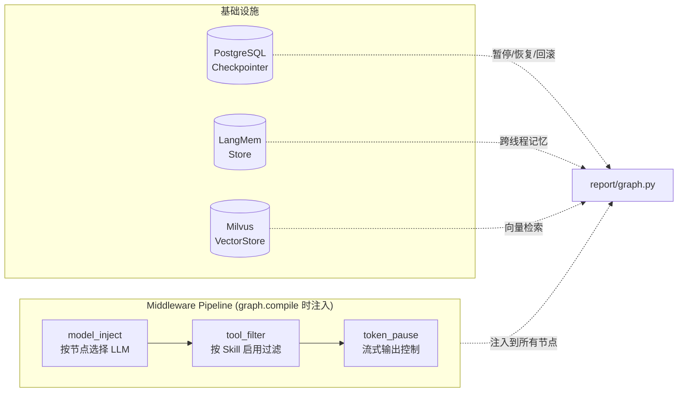
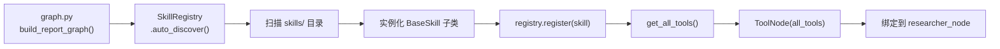

# 🧠 智能调研报告生成器（Research Report Agent）

> **目标**：用户输入一个主题 → 系统自动调研、规划、撰写、审核、配图 → 输出完整报告
>
> **定位**：全行业通用引擎 + 可配置行业模板 + Skill 插件体系 + CLI 交互 + MCP Server，覆盖 LangChain / LangGraph 全部核心特性

---

## 一、功能全景图 × 技术点映射

```
用户输入主题（如："2026年Q1中国新能源汽车市场分析"）
    │
    ▼
┌──────────────────────────────────────────────────────────────────┐
│ 1. 意图理解节点 (intent_node)                                      │
│    技术点: ChatModel, PromptTemplate, Structured Output            │
│    功能: 解析用户主题 → 提取研究目标、范围、深度、输出格式              │
└──────────┬───────────────────────────────────────────────────────┘
           ▼
┌──────────────────────────────────────────────────────────────────┐
│ 2. 调研规划节点 (planner_node)                                     │
│    技术点: Conditional Routing, State Management, JsonOutputParser  │
│    功能: 根据主题生成调研计划（需要哪些数据源、分几个子任务）            │
│    输出: research_plan = [                                         │
│      {task: "搜索行业报告", source: "web"},                         │
│      {task: "检索知识库", source: "rag"},                           │
│      {task: "数据分析", source: "data"}                             │
│    ]                                                               │
└──────────┬───────────────────────────────────────────────────────┘
           ▼
┌──────────────────────────────────────────────────────────────────┐
│ 3. 并行调研阶段 (research_phase) — Map 分支                        │
│    技术点: Send/Command, Subgraph, Tools, ToolNode                 │
│                                                                    │
│    ┌─────────────────────────────────────────┐                     │
│    │ 子图A: 知识库检索 (kb_retriever)          │                     │
│    │   技术点: RAG Retriever, Embeddings,      │                     │
│    │          VectorStore (Milvus),             │                     │
│    │          Document Loaders, Text Splitters  │                     │
│    │   功能: 从已有知识库中检索相关文档片段        │                     │
│    └─────────────────────────────────────────┘                     │
│    ┌─────────────────────────────────────────┐                     │
│    │ 子图B: 网络搜索 (web_search)              │                     │
│    │   技术点: Custom Tool (@tool), ToolNode   │                     │
│    │   功能: 调用搜索引擎获取最新信息             │                     │
│    └─────────────────────────────────────────┘                     │
│    ┌─────────────────────────────────────────┐                     │
│    │ 子图C: 数据分析 (data_analysis)           │                     │
│    │   技术点: Python REPL Tool,               │                     │
│    │          Document Loaders                  │                     │
│    │   功能: 分析数据集、生成统计图表             │                     │
│    └─────────────────────────────────────────┘                     │
│                                                                    │
│    → Reduce: 合并所有调研结果到 state.research_data                  │
└──────────┬───────────────────────────────────────────────────────┘
           ▼
┌──────────────────────────────────────────────────────────────────┐
│ 4. 大纲生成节点 (outliner_node)                                    │
│    技术点: Few-shot Prompting, JSON Output Parser, LCEL Chain      │
│    功能: 基于调研数据生成报告大纲（章节标题 + 要点）                   │
│    输出: outline = [                                               │
│      {chapter: "行业概况", key_points: [...]},                      │
│      {chapter: "竞争格局", key_points: [...]},                      │
│      ...                                                           │
│    ]                                                               │
└──────────┬───────────────────────────────────────────────────────┘
           ▼
┌──────────────────────────────────────────────────────────────────┐
│ 5. 人工审核节点 (human_review_node)                                │
│    技术点: Human-in-the-loop (Interrupt), Checkpointing,           │
│           Time-travel (回滚)                                       │
│    功能: 暂停图执行，等待用户确认/修改大纲                             │
│    交互:                                                           │
│      - 用户确认 → 继续执行                                          │
│      - 用户修改大纲 → 更新 state.outline → 继续                     │
│      - 用户不满意 → Time-travel 回滚到规划阶段重来                   │
└──────────┬───────────────────────────────────────────────────────┘
           ▼
┌──────────────────────────────────────────────────────────────────┐
│ 6. 分章节撰写阶段 (writing_phase) — Map-Reduce                    │
│    技术点: Send/Command (并行), Streaming (token-level),            │
│           RunnableConfig (per-section temperature)                  │
│    功能: 每个章节独立 LLM 调用，并行撰写                              │
│    细节:                                                           │
│      - 数据章节: temperature=0.1 (精确)                              │
│      - 分析章节: temperature=0.5 (有创意)                            │
│      - 总结章节: temperature=0.3 (平衡)                              │
│    → Reduce: 合并所有章节到 state.draft                              │
└──────────┬───────────────────────────────────────────────────────┘
           ▼
┌──────────────────────────────────────────────────────────────────┐
│ 7. 质量审核节点 (reviewer_node) — Self-reflection Loop             │
│    技术点: Conditional Loop (Cycle in graph), Self-reflection      │
│    功能: LLM 审核报告质量，打分 + 给出修改建议                        │
│    流程:                                                           │
│      - 评分 ≥ 8/10 → 通过，进入下一步                                │
│      - 评分 < 8/10 → 返回修改建议 → 重写对应章节（最多 3 轮）         │
│      - 重写仍不达标 → 标记 "需人工介入" 后继续                        │
└──────────┬───────────────────────────────────────────────────────┘
           ▼
┌──────────────────────────────────────────────────────────────────┐
│ 8. 配图生成节点 (illustrator_node)                                 │
│    技术点: 复用 wallpaper 模块 (wan2.5-t2i-preview)                 │
│    功能: 为报告封面 / 关键章节生成配图                                │
│    输入: 章节标题 + 关键词 → prompt → 生成图片                       │
└──────────┬───────────────────────────────────────────────────────┘
           ▼
┌──────────────────────────────────────────────────────────────────┐
│ 9. 记忆存储节点 (memory_node)                                      │
│    技术点: Store (跨线程记忆), LangMem, Cross-thread Memory         │
│    功能:                                                           │
│      - 记住用户的写作风格偏好（正式/轻松、详细/简洁）                   │
│      - 记住常用行业/主题（下次自动推荐）                               │
│      - 记住用户对报告质量的反馈（优化未来输出）                         │
└──────────┬───────────────────────────────────────────────────────┘
           ▼
┌──────────────────────────────────────────────────────────────────┐
│ 10. 输出报告节点 (output_node)                                     │
│     技术点: Streaming (messages-tuple, values, updates, custom),    │
│            Callbacks (token 计数/成本统计)                           │
│     功能:                                                          │
│       - 组装最终报告（Markdown 格式）                                 │
│       - 嵌入配图                                                    │
│       - 实时流式输出给前端                                            │
│       - 统计 token 用量和成本                                        │
└──────────────────────────────────────────────────────────────────┘
```

---

## 二、完整技术覆盖清单

| # | LangChain / LangGraph 特性 | 使用节点 | 具体用法 |
|---|---------------------------|---------|---------|
| 1 | **ChatModel** (init_chat_model) | 所有 LLM 节点 | 通过 `model_provider="openai"` 接入 DashScope |
| 2 | **ChatPromptTemplate** | intent, outliner, writer | 结构化 prompt 模板，支持变量注入 |
| 3 | **Few-shot Prompting** | outliner_node | 提供 2-3 个优秀大纲示例，引导输出格式 |
| 4 | **Structured Output** (with_structured_output) | intent_node | 用户意图提取为 `ResearchIntent` Pydantic 模型 |
| 5 | **JsonOutputParser** | planner_node | 解析调研计划 JSON 数组 |
| 6 | **LCEL Chain** (pipe `\|`) | outliner, writer | `prompt \| llm \| parser` 管道式调用 |
| 7 | **RunnableLambda** | 多处 | 自定义数据转换函数包装为 Runnable |
| 8 | **Custom Tools** (@tool) | web_search, data_analysis | 自定义搜索工具、数据分析工具 |
| 9 | **ToolNode** | research_phase | 自动路由调用注册的工具集 |
| 10 | **RAG Retriever** | kb_retriever | 从 Milvus 向量库检索相关文档 |
| 11 | **Embeddings** (BGE) | kb_retriever | BGE-small-zh-v1.5 向量化查询 |
| 12 | **VectorStore** (Milvus) | kb_retriever | 相似度检索 top-k 文档 |
| 13 | **Document Loaders** | data_analysis | 加载 CSV/PDF/Markdown 参考文档 |
| 14 | **Text Splitters** | kb_retriever | 长文档分块后入库 |
| 15 | **StateGraph** | graph.py | 整个报告生成工作流的核心编排 |
| 16 | **TypedDict State** | state.py | `ReportState` 定义全局状态结构 |
| 17 | **Conditional Routing** (add_conditional_edges) | planner → research | 根据调研计划动态选择需要的子图 |
| 18 | **Subgraph** | 每个调研分支 | kb_retriever / web_search / data_analysis 各自独立子图 |
| 19 | **Send / Command** (并行分支) | research_phase, writing_phase | 并行分发调研子任务、并行撰写章节 |
| 20 | **Map-Reduce** | research → merge, write → merge | 多分支并行 → 合并结果 |
| 21 | **Human-in-the-loop** (interrupt) | human_review_node | `interrupt("请确认大纲")` 暂停等待用户 |
| 22 | **Checkpointer** (PostgreSQL) | 全局 | 中断恢复、对话持久化、断点续写 |
| 23 | **Time-travel** | human_review_node | 用户不满意 → 回滚到 planner 重新规划 |
| 24 | **Store** (跨线程记忆) | memory_node | `store.put(("user", user_id, "preferences"), ...)` |
| 25 | **LangMem** | memory_node | 长期记忆管理（写作风格、常用主题） |
| 26 | **Streaming** (4 种模式) | output_node | messages-tuple / values / updates / custom |
| 27 | **RunnableConfig** | writing_phase | 传递 user_id、per-section temperature |
| 28 | **Middleware** | graph 编译时 | inject_llm、filter_tools、token_pause |
| 29 | **Callbacks** | output_node | Token 计数、成本统计、日志追踪 |
| 30 | **Self-reflection Loop** (Cycle) | reviewer_node | 审核不合格 → 条件边回到 writer → 重写 |
| 31 | **图片生成** (wan2.5) | illustrator_node | 复用 wallpaper 模块生成报告配图 |
| 32 | **FastAPI 集成** | routers/report.py | `/v1/report/generate` 暴露为 HTTP API |

---

## 三、文件结构

```
src/agent/report/
├── __init__.py                  # 模块导出
├── graph.py                     # 主图定义 + 编排（StateGraph 构建）
├── state.py                     # ReportState TypedDict 定义
├── memory.py                    # 用户偏好记忆（Store + LangMem）
│
├── nodes/                       # 所有节点实现
│   ├── __init__.py
│   ├── intent.py                # 1. 意图理解节点
│   │   └── 技术: ChatModel, PromptTemplate, Structured Output
│   │
│   ├── planner.py               # 2. 调研规划节点
│   │   └── 技术: Conditional Routing, JsonOutputParser
│   │
│   ├── researcher.py            # 3. 调研总控节点（分发 + 合并）
│   │   └── 技术: Send/Command, Map-Reduce
│   │
│   ├── outliner.py              # 4. 大纲生成节点
│   │   └── 技术: Few-shot Prompting, LCEL Chain
│   │
│   ├── human_review.py          # 5. 人工审核节点
│   │   └── 技术: Interrupt, Checkpointer, Time-travel
│   │
│   ├── writer.py                # 6. 分章节撰写节点
│   │   └── 技术: Send/Command (并行), RunnableConfig, Streaming
│   │
│   ├── reviewer.py              # 7. 质量审核节点
│   │   └── 技术: Self-reflection, Conditional Loop (Cycle)
│   │
│   ├── illustrator.py           # 8. 配图生成节点
│   │   └── 技术: 复用 agent.momo.wallpaper 模块
│   │
│   └── output.py                # 10. 输出报告节点
│       └── 技术: Streaming, Callbacks
│
├── tools/                       # 自定义工具
│   ├── __init__.py
│   ├── web_search.py            # 网络搜索工具 (@tool)
│   │   └── 对接: Tavily / SerpAPI / DuckDuckGo
│   │
│   ├── kb_retriever.py          # 知识库检索工具
│   │   └── 对接: Milvus VectorStore + BGE Embeddings
│   │
│   └── data_analysis.py         # 数据分析工具
│       └── 对接: Python REPL, pandas, matplotlib
│
├── prompts/                     # Prompt 模板集中管理
│   ├── intent_prompt.md         # 意图理解 prompt
│   ├── planner_prompt.md        # 调研规划 prompt
│   ├── outliner_prompt.md       # 大纲生成 prompt（含 few-shot 示例）
│   ├── writer_prompt.md         # 章节撰写 prompt
│   └── reviewer_prompt.md       # 质量审核 prompt
│
└── templates/                   # 行业模板（可选，Phase 后期）
    ├── general.yaml             # 通用模板
    ├── tech.yaml                # 科技行业模板
    ├── finance.yaml             # 金融行业模板
    └── ecommerce.yaml           # 电商行业模板

src/services/routers/
└── report.py                    # FastAPI 路由（/v1/report/*）

src/schemas/
└── report_schema.py             # 请求/响应 Pydantic 模型

tests/
├── unit_tests/
│   └── test_report_nodes.py     # 各节点单元测试
└── integration_tests/
    └── test_report_graph.py     # 完整图集成测试
```

---

## 四、开发顺序

### Phase 1：骨架搭建（1-2 天）

**目标**：跑通最简单的 `意图 → 大纲 → 撰写` 串行流程

| 步骤 | 文件 | 内容 |
|------|------|------|
| 1.1 | `state.py` | 定义 `ReportState`（TypedDict） |
| 1.2 | `nodes/intent.py` | 意图理解节点（Structured Output） |
| 1.3 | `nodes/outliner.py` | 大纲生成节点（Few-shot + LCEL Chain） |
| 1.4 | `nodes/writer.py` | 简单撰写节点（串行，单章节） |
| 1.5 | `graph.py` | 串联 `intent → outliner → writer → END` |
| 1.6 | 本地测试 | `if __name__ == "__main__": asyncio.run(main())` |

**技术点覆盖**：
- [x] ChatModel
- [x] PromptTemplate
- [x] Structured Output
- [x] Few-shot Prompting
- [x] JsonOutputParser
- [x] LCEL Chain (pipe `|`)
- [x] RunnableLambda
- [x] StateGraph
- [x] TypedDict State

---

### Phase 2：工具 + RAG 调研（1-2 天）

**目标**：加入调研阶段，能从知识库和网络获取信息

| 步骤 | 文件 | 内容 |
|------|------|------|
| 2.1 | `tools/web_search.py` | 网络搜索工具（@tool + Tavily） |
| 2.2 | `tools/kb_retriever.py` | 知识库检索工具（Milvus + BGE） |
| 2.3 | `tools/data_analysis.py` | 数据分析工具（Python REPL） |
| 2.4 | `nodes/planner.py` | 调研规划节点（输出调研计划） |
| 2.5 | `nodes/researcher.py` | 调研总控（ToolNode 调用工具） |
| 2.6 | `graph.py` | 加入 `planner → researcher → outliner` |

**技术点覆盖**：
- [x] Custom Tools (@tool)
- [x] ToolNode
- [x] RAG Retriever
- [x] Embeddings (BGE)
- [x] VectorStore (Milvus)
- [x] Document Loaders
- [x] Text Splitters
- [x] Conditional Routing

---

### Phase 3：人工审核 + Checkpoint（1 天）

**目标**：大纲生成后暂停，等待用户确认，支持回滚

| 步骤 | 文件 | 内容 |
|------|------|------|
| 3.1 | `nodes/human_review.py` | interrupt 暂停节点 |
| 3.2 | `graph.py` | 加入 `outliner → human_review → writer` |
| 3.3 | `graph.py` | 编译时加入 PostgreSQL Checkpointer |
| 3.4 | 测试 | 测试中断 → 恢复 → 回滚（time-travel） |

**技术点覆盖**：
- [x] Human-in-the-loop (Interrupt)
- [x] Checkpointer (PostgreSQL)
- [x] Time-travel

---

### Phase 4：并行 Map-Reduce（1 天）

**目标**：调研阶段并行执行，撰写阶段并行执行

| 步骤 | 文件 | 内容 |
|------|------|------|
| 4.1 | `nodes/researcher.py` | 用 Send() 并行分发调研子任务 |
| 4.2 | `nodes/writer.py` | 用 Send() 并行撰写多章节 |
| 4.3 | `graph.py` | 加入 Subgraph（每个调研分支独立子图） |
| 4.4 | `graph.py` | Reduce 节点合并并行结果 |

**技术点覆盖**：
- [x] Send / Command (并行分支)
- [x] Map-Reduce
- [x] Subgraph
- [x] RunnableConfig (per-section temperature)

---

### Phase 5：自我审核循环（半天）

**目标**：LLM 自动审核报告质量，不合格自动重写

| 步骤 | 文件 | 内容 |
|------|------|------|
| 5.1 | `nodes/reviewer.py` | 质量审核节点（打分 + 修改建议） |
| 5.2 | `graph.py` | 条件边：评分 ≥ 8 → 通过，< 8 → 回到 writer |
| 5.3 | `graph.py` | 加入最大重试次数（3 轮） |

**技术点覆盖**：
- [x] Self-reflection Loop
- [x] Conditional Loop (Cycle in graph)

---

### Phase 6：记忆 + 流式输出 + 配图（1 天）

**目标**：跨会话记住用户偏好，实时流式输出，自动配图

| 步骤 | 文件 | 内容 |
|------|------|------|
| 6.1 | `memory.py` | Store 跨线程记忆（写作风格偏好） |
| 6.2 | `nodes/illustrator.py` | 复用 wallpaper 模块生成配图 |
| 6.3 | `nodes/output.py` | 组装报告 + 流式输出 |
| 6.4 | `graph.py` | 加入 Middleware（inject_llm, filter_tools） |
| 6.5 | `graph.py` | 加入 Callbacks（token 计数） |

**技术点覆盖**：
- [x] Store (跨线程记忆)
- [x] LangMem
- [x] Streaming (4 种模式)
- [x] Middleware
- [x] Callbacks
- [x] 图片生成 (wan2.5)

---

### Phase 7：FastAPI 集成（1 天）

**目标**：通过 HTTP API 暴露报告生成能力

| 步骤 | 文件 | 内容 |
|------|------|------|
| 7.1 | `src/schemas/report_schema.py` | 请求/响应模型 |
| 7.2 | `src/services/routers/report.py` | API 路由 |
| 7.3 | `src/services/main_app.py` | 注册路由 |
| 7.4 | 集成测试 | 完整端到端测试 |

**API 设计**：

```
POST /v1/report/generate          # 创建报告生成任务
GET  /v1/report/{thread_id}/stream # 流式获取报告
POST /v1/report/{thread_id}/review # 提交大纲审核结果
GET  /v1/report/{thread_id}/status # 查询任务状态
POST /v1/report/{thread_id}/rollback # 回滚到指定阶段
```

**技术点覆盖**：
- [x] FastAPI 集成
- [x] LangGraph SDK 调用

---

## 五、ReportState 预览

```python
from typing import TypedDict, Optional, Annotated
from pydantic import BaseModel
from langgraph.graph import add_messages
from operator import add

class ResearchIntent(BaseModel):
    """用户调研意图"""
    topic: str              # 主题
    scope: str              # 范围（如 "中国市场"）
    depth: str              # 深度: "概览" | "深度" | "专业"
    output_format: str      # "markdown" | "pdf" | "ppt"
    industry: str           # 行业分类

class OutlineItem(BaseModel):
    """大纲条目"""
    chapter: str            # 章节标题
    key_points: list[str]   # 关键要点
    data_sources: list[str] # 需要的数据来源

class ReviewResult(BaseModel):
    """审核结果"""
    score: int              # 1-10 评分
    passed: bool            # 是否通过
    feedback: str           # 修改建议
    chapters_to_revise: list[int]  # 需要重写的章节索引

class ReportState(TypedDict):
    # --- 输入 ---
    user_query: str                              # 用户原始输入
    user_id: str                                 # 用户 ID（从 RunnableConfig 获取）

    # --- 意图 ---
    intent: Optional[ResearchIntent]             # 解析后的意图

    # --- 调研 ---
    research_plan: list[dict]                    # 调研计划
    research_data: Annotated[list[str], add]     # 调研结果（多分支合并）

    # --- 大纲 ---
    outline: list[OutlineItem]                   # 报告大纲
    outline_approved: bool                       # 大纲是否通过审核

    # --- 撰写 ---
    chapters: Annotated[list[str], add]          # 各章节内容（并行合并）
    draft: str                                   # 合并后的完整草稿

    # --- 审核 ---
    review: Optional[ReviewResult]               # 审核结果
    review_count: int                            # 审核轮次（防止无限循环）

    # --- 配图 ---
    illustrations: list[str]                     # 配图 URL 列表

    # --- 输出 ---
    final_report: str                            # 最终报告（Markdown）
    token_usage: dict                            # token 用量统计
```

---

## 六、时间表总览

| 阶段 | 内容 | 预计耗时 | 累计 |
|------|------|---------|------|
| Phase 1 | 骨架：意图 → 大纲 → 撰写（串行） | 1-2 天 | 2 天 |
| Phase 2 | 工具 + RAG 调研子图 | 1-2 天 | 4 天 |
| Phase 3 | 人工审核 + Checkpoint + 回滚 | 1 天 | 5 天 |
| Phase 4 | 并行 Map-Reduce（调研+撰写） | 1 天 | 6 天 |
| Phase 5 | 自我审核循环（Self-reflection） | 半天 | 6.5 天 |
| Phase 6 | 记忆 + 流式输出 + 配图 | 1 天 | 7.5 天 |
| Phase 7 | FastAPI 路由集成 + 测试 | 1 天 | 8.5 天 |
| Phase 8 | Skill 插件体系 | 1-2 天 | 10 天 |
| Phase 9 | CLI 交互工具 | 1 天 | 11 天 |
| Phase 10 | MCP Server 暴露 | 1 天 | **12 天** |

---

## 七、与现有项目的复用关系

| 现有模块 | 复用方式 |
|---------|---------|
| `agent/momo/wallpaper.py` | 直接作为 illustrator_node 的底层实现 |
| `agent/momo/init_llm.py` | 报告各节点的 LLM 初始化 |
| `agent/core/graph.py` | 参考 middleware 模式（inject_llm, filter_tools） |
| `agent/memory/` | 复用 LangMem Store 实现 |
| `llamarag/` | kb_retriever 工具对接 Milvus + BGE |
| `models/KnowledgeBaseModel.py` | 知识库元数据查询 |
| `repositories/entity_repository.py` | 实体词典辅助术语标准化 |
| `services/create_app.py` | FastAPI lifespan 注册新路由 |
| `utils/sql_db.py` | 数据库会话管理 |
| `monitor/` | LLM 调用统计、成本分析 |

---

## 八、Skill 插件体系

### 8.1 设计理念

Skill 是**可热插拔的能力单元**，每个 Skill 封装一组特定领域的 Tool + Prompt + 后处理逻辑。Agent 根据任务自动选择合适的 Skill 组合。

```
┌─────────────────────────────────────────────────┐
│                  Skill Registry                  │
│                                                  │
│  ┌──────────┐ ┌──────────┐ ┌──────────────────┐ │
│  │ 网络搜索  │ │ 知识库RAG │ │ 数据分析+可视化  │ │
│  │ Skill    │ │ Skill    │ │ Skill            │ │
│  └──────────┘ └──────────┘ └──────────────────┘ │
│  ┌──────────┐ ┌──────────┐ ┌──────────────────┐ │
│  │ 文生图    │ │ 代码执行  │ │ 文件读写         │ │
│  │ Skill    │ │ Skill    │ │ Skill            │ │
│  └──────────┘ └──────────┘ └──────────────────┘ │
│  ┌──────────┐ ┌──────────┐ ┌──────────────────┐ │
│  │ PDF导出   │ │ 翻译     │ │ 竞品监控         │ │
│  │ Skill    │ │ Skill    │ │ Skill            │ │
│  └──────────┘ └──────────┘ └──────────────────┘ │
│  ┌──────────┐ ┌──────────┐                      │
│  │ 邮件发送  │ │ 自定义…  │  ← 用户可扩展       │
│  │ Skill    │ │ Skill    │                      │
│  └──────────┘ └──────────┘                      │
└─────────────────────────────────────────────────┘
```

### 8.2 Skill 接口定义

```python
# src/agent/report/skills/base.py
from abc import ABC, abstractmethod
from typing import Any
from langchain_core.tools import BaseTool
from pydantic import BaseModel

class SkillMetadata(BaseModel):
    """Skill 元数据"""
    name: str                    # 唯一标识: "web_search", "kb_rag", etc.
    display_name: str            # 展示名: "网络搜索"
    description: str             # 描述: 供 LLM 选择用
    version: str                 # 版本号
    author: str                  # 作者
    tags: list[str]              # 标签: ["search", "research"]
    enabled: bool = True         # 是否启用
    priority: int = 0            # 优先级（同类 Skill 排序）

class BaseSkill(ABC):
    """Skill 基类"""

    @abstractmethod
    def metadata(self) -> SkillMetadata:
        """返回 Skill 元数据"""
        ...

    @abstractmethod
    def get_tools(self) -> list[BaseTool]:
        """返回该 Skill 提供的 Tool 列表"""
        ...

    @abstractmethod
    def get_system_prompt(self) -> str:
        """返回该 Skill 的系统提示词片段（会注入到 Agent prompt 中）"""
        ...

    def on_activate(self, config: dict) -> None:
        """Skill 被激活时的初始化钩子（可选）"""
        pass

    def on_deactivate(self) -> None:
        """Skill 被停用时的清理钩子（可选）"""
        pass

    def post_process(self, result: Any) -> Any:
        """对工具调用结果的后处理（可选）"""
        return result
```

### 8.3 Skill 注册表

```python
# src/agent/report/skills/registry.py
class SkillRegistry:
    """Skill 注册中心 — 管理所有已注册的 Skill"""

    _skills: dict[str, BaseSkill] = {}

    @classmethod
    def register(cls, skill: BaseSkill) -> None:
        meta = skill.metadata()
        cls._skills[meta.name] = skill

    @classmethod
    def get(cls, name: str) -> BaseSkill | None:
        return cls._skills.get(name)

    @classmethod
    def list_enabled(cls) -> list[BaseSkill]:
        return [s for s in cls._skills.values() if s.metadata().enabled]

    @classmethod
    def get_all_tools(cls) -> list[BaseTool]:
        tools = []
        for skill in cls.list_enabled():
            tools.extend(skill.get_tools())
        return tools

    @classmethod
    def get_combined_prompt(cls) -> str:
        prompts = []
        for skill in cls.list_enabled():
            p = skill.get_system_prompt()
            if p:
                prompts.append(f"## {skill.metadata().display_name}\n{p}")
        return "\n\n".join(prompts)

    @classmethod
    def auto_discover(cls, package_path: str = "agent.report.skills") -> None:
        """自动发现并注册 skills 目录下的所有 Skill"""
        import importlib
        import pkgutil
        pkg = importlib.import_module(package_path)
        for _, module_name, _ in pkgutil.iter_modules(pkg.__path__):
            module = importlib.import_module(f"{package_path}.{module_name}")
            for attr_name in dir(module):
                attr = getattr(module, attr_name)
                if (isinstance(attr, type)
                    and issubclass(attr, BaseSkill)
                    and attr is not BaseSkill):
                    cls.register(attr())
```

### 8.4 内置 Skill 清单

| Skill | 文件 | 提供的 Tools | 用途 |
|-------|------|-------------|------|
| `WebSearchSkill` | `skills/web_search.py` | `tavily_search`, `scrape_url` | 网络调研 |
| `KBRetrievalSkill` | `skills/kb_retrieval.py` | `search_knowledge_base`, `list_kb` | 知识库 RAG |
| `DataAnalysisSkill` | `skills/data_analysis.py` | `python_repl`, `plot_chart` | 数据分析+图表 |
| `ImageGenSkill` | `skills/image_gen.py` | `generate_image` | 文生图（复用 wallpaper） |
| `CodeExecSkill` | `skills/code_exec.py` | `run_python`, `run_shell` | 代码执行 |
| `FileIOSkill` | `skills/file_io.py` | `read_file`, `write_file`, `list_dir` | 文件读写 |
| `PDFExportSkill` | `skills/pdf_export.py` | `export_to_pdf`, `export_to_docx` | 报告导出 |
| `TranslationSkill` | `skills/translation.py` | `translate_text` | 多语言翻译 |
| `EmailSkill` | `skills/email.py` | `send_email` | 报告邮件发送 |
| `CompetitorSkill` | `skills/competitor.py` | `monitor_competitor`, `diff_report` | 竞品监控 |

### 8.5 Skill × Graph 集成方式

```python
# graph.py 中的集成
from agent.report.skills.registry import SkillRegistry

def build_report_graph():
    # 自动发现所有 Skill
    SkillRegistry.auto_discover()

    # 获取所有启用 Skill 的 Tools
    all_tools = SkillRegistry.get_all_tools()

    # 构建图时绑定
    workflow = StateGraph(ReportState)
    ...
    # ToolNode 自动包含所有 Skill 的工具
    workflow.add_node("tools", ToolNode(all_tools))
    ...
```

---

## 九、CLI 交互工具

### 9.1 设计理念

提供命令行界面，开发者/运维可以不启动 FastAPI 也能直接使用 Agent：

```bash
# 一键生成报告
report-agent generate "2026年中国新能源汽车市场分析"

# 交互式模式（支持大纲审核、实时修改）
report-agent interactive

# 管理 Skill
report-agent skill list
report-agent skill enable web_search
report-agent skill disable email

# 查看历史
report-agent history list
report-agent history resume <thread_id>
report-agent history rollback <thread_id> --to planner
```

### 9.2 CLI 架构

```python
# src/agent/report/cli/__init__.py
# 使用 Typer（FastAPI 作者的 CLI 框架）

import typer
from rich.console import Console
from rich.live import Live
from rich.markdown import Markdown

app = typer.Typer(name="report-agent", help="智能调研报告生成器 CLI")
console = Console()

# --- 子命令组 ---
skill_app = typer.Typer(help="Skill 插件管理")
history_app = typer.Typer(help="历史任务管理")
config_app = typer.Typer(help="配置管理")
app.add_typer(skill_app, name="skill")
app.add_typer(history_app, name="history")
app.add_typer(config_app, name="config")
```

### 9.3 核心命令

```
report-agent
├── generate <topic>              # 一键生成（非交互式）
│   ├── --depth <概览|深度|专业>     # 报告深度
│   ├── --format <md|pdf|docx>     # 输出格式
│   ├── --output <path>            # 输出路径
│   ├── --industry <行业>           # 行业模板
│   ├── --no-image                 # 跳过配图
│   └── --stream                   # 流式输出到终端
│
├── interactive                   # 交互式模式
│   └── (进入 REPL 循环，支持实时审核大纲、修改、重来)
│
├── skill                         # Skill 管理
│   ├── list                      # 列出所有 Skill 及状态
│   ├── enable <name>             # 启用 Skill
│   ├── disable <name>            # 禁用 Skill
│   ├── info <name>               # 查看 Skill 详情
│   └── install <path|git_url>    # 安装第三方 Skill
│
├── history                       # 历史任务
│   ├── list                      # 列出历史任务
│   ├── show <thread_id>          # 查看某次报告
│   ├── resume <thread_id>        # 恢复中断的任务
│   ├── rollback <thread_id>      # 回滚到指定阶段
│   └── export <thread_id>        # 导出历史报告
│
├── config                        # 配置
│   ├── show                      # 显示当前配置
│   ├── set <key> <value>         # 设置配置项
│   └── reset                     # 重置为默认
│
└── serve                         # 启动服务
    ├── --api                     # 启动 FastAPI 服务
    └── --mcp                     # 启动 MCP Server
```

### 9.4 交互式模式体验

```
$ report-agent interactive

🧠 智能调研报告生成器 v1.0
━━━━━━━━━━━━━━━━━━━━━━━━━━━

📝 请输入研究主题: 2026年中国新能源汽车市场分析

🔍 正在分析意图...
  ✅ 主题: 中国新能源汽车市场
  ✅ 范围: 2026年
  ✅ 深度: 深度分析

📋 正在规划调研...
  ✅ 调研计划:
    1. 搜索行业最新报告 (web_search)
    2. 检索内部知识库 (kb_retrieval)
    3. 销量数据分析 (data_analysis)

⏳ 正在调研 [████████████████████████████] 3/3

📑 生成的大纲:
  1. 行业概况与政策环境
  2. 市场规模与增长趋势
  3. 主要玩家竞争格局
  4. 技术路线对比 (纯电/混动/氢能)
  5. 消费者洞察
  6. 未来展望与投资建议

❓ 请选择操作:
  [1] 确认大纲，开始撰写
  [2] 修改大纲
  [3] 重新规划
  [4] 退出

> 1

✍️ 正在撰写 [██████░░░░░░░░░░░░░░░░░░░░░░] 2/6
  章节 1: 行业概况... ✅
  章节 2: 市场规模... (撰写中)
```

### 9.5 CLI 文件结构

```
src/agent/report/cli/
├── __init__.py          # Typer app 定义 + 子命令注册
├── commands/
│   ├── generate.py      # generate 命令
│   ├── interactive.py   # interactive 交互模式
│   ├── skill.py         # skill 子命令组
│   ├── history.py       # history 子命令组
│   └── config.py        # config 子命令组
├── display/
│   ├── progress.py      # Rich 进度条/状态展示
│   ├── markdown.py      # Markdown 终端渲染
│   └── table.py         # 表格展示工具
└── serve.py             # serve 命令（启动 API/MCP）
```

### 9.6 pyproject.toml 注册入口

```toml
[project.scripts]
report-agent = "agent.report.cli:app"
```

安装后即可全局使用 `report-agent` 命令。

---

## 十、MCP Server（Model Context Protocol）

### 10.1 设计理念

将报告 Agent 的能力暴露为 **MCP Server**，这样任何支持 MCP 的客户端（VS Code Copilot、Claude Desktop、Cursor 等）都能直接调用：

```
┌───────────────────────────────────┐
│       MCP 客户端（任意）            │
│  VS Code Copilot / Claude Desktop │
│  / Cursor / 自定义客户端           │
└──────────┬────────────────────────┘
           │ MCP Protocol (stdio/SSE)
           ▼
┌───────────────────────────────────┐
│     Report Agent MCP Server       │
│                                   │
│  Tools:                           │
│    - generate_report              │
│    - search_knowledge_base        │
│    - analyze_data                 │
│    - generate_image               │
│    - manage_skills                │
│                                   │
│  Resources:                       │
│    - report://{thread_id}         │
│    - skill://list                 │
│    - history://recent             │
│                                   │
│  Prompts:                         │
│    - research_report              │
│    - quick_analysis               │
│    - competitive_analysis         │
└───────────────────────────────────┘
```

### 10.2 MCP Server 实现

```python
# src/agent/report/mcp_server.py
from mcp.server import Server
from mcp.server.stdio import stdio_server
from mcp.types import Tool, TextContent, Resource, Prompt

server = Server("report-agent")

# --- Tools ---
@server.tool()
async def generate_report(topic: str, depth: str = "深度", industry: str = "通用") -> str:
    """生成一份完整的调研报告"""
    graph = build_report_graph()
    result = await graph.ainvoke({
        "user_query": topic,
        "depth": depth,
        "industry": industry,
    })
    return result["final_report"]

@server.tool()
async def search_knowledge_base(query: str, kb_id: str = "") -> str:
    """从知识库中检索相关信息"""
    ...

@server.tool()
async def analyze_data(data_description: str, analysis_type: str = "统计") -> str:
    """分析数据并生成图表"""
    ...

@server.tool()
async def generate_image(prompt: str, size: str = "1280*1280") -> str:
    """生成配图"""
    ...

# --- Resources ---
@server.resource("report://{thread_id}")
async def get_report(thread_id: str) -> str:
    """获取已生成的报告"""
    ...

@server.resource("skill://list")
async def list_skills() -> str:
    """列出所有可用的 Skill"""
    ...

# --- Prompts ---
@server.prompt("research_report")
async def research_report_prompt(topic: str) -> list:
    """生成调研报告的 prompt 模板"""
    return [{"role": "user", "content": f"请帮我生成一份关于「{topic}」的深度调研报告"}]

@server.prompt("quick_analysis")
async def quick_analysis_prompt(topic: str) -> list:
    """快速分析的 prompt 模板"""
    return [{"role": "user", "content": f"请快速分析「{topic}」的现状和趋势，500字以内"}]

# --- 启动 ---
async def main():
    async with stdio_server() as (read, write):
        await server.run(read, write)
```

### 10.3 MCP 配置文件

```json
// .vscode/mcp.json — 在 VS Code 中直接使用
{
  "servers": {
    "report-agent": {
      "type": "stdio",
      "command": "uv",
      "args": ["run", "python", "-m", "agent.report.mcp_server"],
      "env": {
        "DASHSCOPE_API_KEY": "${env:DASHSCOPE_API_KEY}"
      }
    }
  }
}
```

```json
// claude_desktop_config.json — 在 Claude Desktop 中使用
{
  "mcpServers": {
    "report-agent": {
      "command": "uv",
      "args": ["--directory", "/path/to/fastapi-agent", "run", "python", "-m", "agent.report.mcp_server"]
    }
  }
}
```

### 10.4 MCP 文件结构

```
src/agent/report/
├── mcp_server.py           # MCP Server 主入口
├── mcp_tools.py            # MCP Tool 定义（从 Skill 自动映射）
├── mcp_resources.py         # MCP Resource 定义
└── mcp_prompts.py           # MCP Prompt 模板
```

---

## 十一、扩展后的完整技术覆盖清单

在原有 32 项基础上新增：

| # | 技术特性 | 使用位置 | 具体用法 |
|---|---------|---------|---------|
| 33 | **Skill 插件体系** | skills/ | BaseSkill 抽象 + Registry 自动发现 |
| 34 | **Tool 动态注册** | SkillRegistry | Skill 启用/禁用时动态更新 ToolNode |
| 35 | **CLI (Typer)** | cli/ | 命令行交互，支持 generate/interactive/skill/history |
| 36 | **Rich 终端 UI** | cli/display/ | 进度条、Markdown 渲染、表格展示 |
| 37 | **MCP Server** | mcp_server.py | stdio/SSE 协议暴露 Agent 能力 |
| 38 | **MCP Tools** | mcp_tools.py | @server.tool() 暴露为外部可调用工具 |
| 39 | **MCP Resources** | mcp_resources.py | report://, skill:// 资源协议 |
| 40 | **MCP Prompts** | mcp_prompts.py | 预置 prompt 模板供客户端使用 |
| 41 | **热插拔** | SkillRegistry | 运行时动态加载/卸载 Skill |
| 42 | **pyproject.toml Scripts** | pyproject.toml | `report-agent` 全局 CLI 入口 |

---

## 十二、Report 模块文件结构

### 设计原则

1. **自包含**：report 模块自身完备，所有能力内聚在 `src/agent/report/` 下
2. **四层分离**：`引擎层`（图编排）/ `节点层`（业务逻辑）/ `插件层`（Skill）/ `接入层`（CLI + MCP + API）
3. **可独立运行**：CLI 和 MCP 不依赖 FastAPI，可以单独启动

### 完整流程图

```mermaid
graph TB
    %% ═══════════════════════════════════════════
    %% 入口
    %% ═══════════════════════════════════════════
    START((🚀 START)) --> intent

    %% ═══════════════════════════════════════════
    %% 1. 意图理解
    %% ═══════════════════════════════════════════
    subgraph INTENT["1️⃣ 意图理解"]
        intent[/"intent_node<br/>ChatModel + Structured Output<br/>→ ResearchIntent"/]
    end

    intent --> planner

    %% ═══════════════════════════════════════════
    %% 2. 调研规划
    %% ═══════════════════════════════════════════
    subgraph PLAN["2️⃣ 调研规划"]
        planner[/"planner_node<br/>Conditional Routing<br/>JsonOutputParser<br/>→ research_plan[]"/]
    end

    planner --> dispatch

    %% ═══════════════════════════════════════════
    %% 3. 并行调研 (Map)
    %% ═══════════════════════════════════════════
    subgraph RESEARCH["3️⃣ 并行调研 (Send → Map)"]
        dispatch{{"Send() 分发"}}

        subgraph SUB_KB["子图A: 知识库检索"]
            kb["kb_search<br/>Milvus + BGE<br/>RAG Retriever"]
        end

        subgraph SUB_WEB["子图B: 网络搜索"]
            web["web_search<br/>Tavily / SerpAPI<br/>Custom @tool"]
        end

        subgraph SUB_DATA["子图C: 数据分析"]
            data["python_repl<br/>pandas + matplotlib<br/>Document Loaders"]
        end

        dispatch -->|"source=rag"| kb
        dispatch -->|"source=web"| web
        dispatch -->|"source=data"| data

        kb --> merge
        web --> merge
        data --> merge

        merge(["Reduce 合并<br/>→ state.research_data"])
    end

    merge --> outliner

    %% ═══════════════════════════════════════════
    %% 4. 大纲生成
    %% ═══════════════════════════════════════════
    subgraph OUTLINE["4️⃣ 大纲生成"]
        outliner[/"outliner_node<br/>Few-shot + LCEL Chain<br/>→ outline[]"/]
    end

    outliner --> human_review

    %% ═══════════════════════════════════════════
    %% 5. 人工审核 (interrupt)
    %% ═══════════════════════════════════════════
    subgraph REVIEW["5️⃣ 人工审核"]
        human_review["human_review_node<br/>interrupt() 暂停<br/>Checkpoint 持久化"]
        user_decision{{"用户决策"}}

        human_review --> user_decision
    end

    user_decision -->|"✅ 确认"| writer_dispatch
    user_decision -->|"✏️ 修改大纲"| outliner
    user_decision -->|"🔄 重新规划<br/>Time-travel"| planner

    %% ═══════════════════════════════════════════
    %% 6. 并行撰写 (Map-Reduce)
    %% ═══════════════════════════════════════════
    subgraph WRITE["6️⃣ 并行撰写 (Send → Map-Reduce)"]
        writer_dispatch{{"Send() 分发章节"}}

        w1["writer_node<br/>章节1: 概况<br/>temp=0.3"]
        w2["writer_node<br/>章节2: 数据<br/>temp=0.1"]
        w3["writer_node<br/>章节3: 分析<br/>temp=0.5"]
        wn["writer_node<br/>章节N...<br/>RunnableConfig"]

        writer_dispatch --> w1
        writer_dispatch --> w2
        writer_dispatch --> w3
        writer_dispatch --> wn

        w1 --> write_merge
        w2 --> write_merge
        w3 --> write_merge
        wn --> write_merge

        write_merge(["Reduce 合并<br/>→ state.chapters → draft"])
    end

    write_merge --> reviewer

    %% ═══════════════════════════════════════════
    %% 7. 质量审核 (Self-reflection Loop)
    %% ═══════════════════════════════════════════
    subgraph QA["7️⃣ 质量审核 (Cycle)"]
        reviewer[/"reviewer_node<br/>Self-reflection<br/>打分 + 修改建议"/]
        qa_check{{"score ≥ 8?"}}

        reviewer --> qa_check
    end

    qa_check -->|"❌ < 8 且 count < 3"| writer_dispatch
    qa_check -->|"✅ ≥ 8 或 count ≥ 3"| illustrator

    %% ═══════════════════════════════════════════
    %% 8. 配图生成
    %% ═══════════════════════════════════════════
    subgraph IMG["8️⃣ 配图生成"]
        illustrator[/"illustrator_node<br/>DashScope wan2.5<br/>封面 + 章节配图"/]
    end

    illustrator --> memory_node

    %% ═══════════════════════════════════════════
    %% 9. 记忆存储
    %% ═══════════════════════════════════════════
    subgraph MEM["9️⃣ 记忆存储"]
        memory_node[/"memory_node<br/>LangMem Store<br/>用户偏好 + 调研历史"/]
    end

    memory_node --> output

    %% ═══════════════════════════════════════════
    %% 10. 输出报告
    %% ═══════════════════════════════════════════
    subgraph OUT["🔟 输出报告"]
        output[/"output_node<br/>Streaming 流式输出<br/>Markdown 拼装<br/>Token 统计 (Callbacks)"/]
    end

    output --> END((🏁 END))

    %% ═══════════════════════════════════════════
    %% 样式
    %% ═══════════════════════════════════════════
    classDef startEnd fill:#1a1a2e,stroke:#e94560,color:#fff,stroke-width:2px
    classDef nodeBox fill:#16213e,stroke:#0f3460,color:#e8e8e8,stroke-width:1px
    classDef decision fill:#533483,stroke:#e94560,color:#fff,stroke-width:2px
    classDef mergeBox fill:#0f3460,stroke:#53a8b6,color:#fff,stroke-width:1px
    classDef subgraphBg fill:#0d1117,stroke:#30363d,color:#c9d1d9

    class START,END startEnd
    class intent,planner,outliner,human_review,reviewer,illustrator,memory_node,output nodeBox
    class kb,web,data,w1,w2,w3,wn nodeBox
    class dispatch,user_decision,qa_check,writer_dispatch decision
    class merge,write_merge mergeBox
```



### 中间件管线（编译时注入）



### Skill 插件加载流程



### 文件树

```
src/agent/report/
│
│  ─── 引擎层 ───
├── __init__.py                    # 模块导出: build_report_graph, ReportState
├── graph.py                       # 主图定义 (StateGraph + 编排 + Checkpointer)
├── state.py                       # ReportState TypedDict 全局状态
├── config.py                      # 报告配置 (depth, format, industry 等)
├── llm.py                         # LLM 初始化 (ChatModel 工厂)
│
│  ─── 图节点 ───
├── nodes/
│   ├── __init__.py
│   ├── intent.py                  # 意图理解 → Structured Output → ResearchIntent
│   ├── planner.py                 # 调研规划 → Conditional Routing → research_plan[]
│   ├── researcher.py              # 调研执行 → Send() 并行 + ToolNode 调用 Skill Tools
│   ├── outliner.py                # 大纲生成 → Few-shot + LCEL Chain → outline[]
│   ├── human_review.py            # 人工审核 → interrupt() 暂停等待确认
│   ├── writer.py                  # 分章节撰写 → Send() 并行 + RunnableConfig temperature
│   ├── reviewer.py                # 质量审核 → Self-reflection Loop (score < 8 回写)
│   ├── illustrator.py             # 配图生成 → DashScope 文生图
│   └── output.py                  # 输出组装 → Streaming + Markdown 拼装 + Token 统计
│
│  ─── 记忆 ───
├── memory/
│   ├── __init__.py
│   ├── store.py                   # LangMem Store (用户偏好 + 调研历史)
│   ├── context_window.py          # 短期上下文窗口 (对话轮次裁剪)
│   └── checkpoint.py              # Checkpoint 管理 (暂停/恢复/回滚)
│
│  ─── 中间件 ───
├── middleware/
│   ├── __init__.py
│   ├── model_inject.py            # LLM 动态注入 (按节点选择不同模型)
│   ├── tool_filter.py             # Tool 过滤 (按 Skill 启用状态)
│   └── token_pause.py             # Token 级暂停 (流式输出控制)
│
│  ─── 控制能力 ───
├── control/
│   ├── __init__.py
│   ├── interrupt.py               # Human-in-the-loop 中断
│   └── time_travel.py             # 回滚到任意 checkpoint
│
│  ─── Tool 注册 ───
├── tools/
│   ├── __init__.py                # tool_catalog 汇总导出
│   ├── registry.py                # Tool 注册装饰器 + 动态发现
│   ├── web_search.py              # 网络搜索 (Tavily / SerpAPI / DuckDuckGo)
│   ├── kb_search.py               # 知识库向量检索 (Milvus + BGE)
│   ├── python_repl.py             # Python REPL 执行 (pandas / matplotlib)
│   ├── image_gen.py               # 文生图 (DashScope wan2.5)
│   ├── file_io.py                 # 文件读写
│   ├── pdf_export.py              # PDF/DOCX 导出 (weasyprint / python-docx)
│   ├── translate.py               # 多语言翻译 (LLM / DeepL)
│   └── email_send.py              # 邮件发送 (SMTP / SendGrid)
│
│  ─── Skill 插件体系 ───
├── skills/
│   ├── __init__.py                # auto_discover() 入口
│   ├── base.py                    # BaseSkill 抽象基类
│   │                              #   metadata() → SkillMetadata
│   │                              #   get_tools() → list[BaseTool]
│   │                              #   get_system_prompt() → str
│   │                              #   on_activate() / on_deactivate()
│   │                              #   post_process()
│   ├── registry.py                # SkillRegistry 注册中心
│   │                              #   register / get / list_enabled
│   │                              #   get_all_tools / get_combined_prompt
│   │                              #   auto_discover (扫描本目录)
│   │
│   │  ─── 内置 Skill (每个组合 tools/ 中的工具) ───
│   ├── web_search.py              # 网络搜索 Skill → tools/web_search
│   ├── kb_retrieval.py            # 知识库检索 Skill → tools/kb_search
│   ├── data_analysis.py           # 数据分析 Skill → tools/python_repl
│   ├── image_gen.py               # 文生图 Skill → tools/image_gen
│   ├── code_exec.py               # 代码执行 Skill → tools/python_repl
│   ├── file_io.py                 # 文件读写 Skill → tools/file_io
│   ├── pdf_export.py              # 导出 Skill → tools/pdf_export
│   ├── translation.py             # 翻译 Skill → tools/translate
│   ├── email.py                   # 邮件 Skill → tools/email_send
│   └── competitor.py              # 竞品监控 Skill (组合 web_search + python_repl)
│
│  ─── CLI 交互工具 ───
├── cli/
│   ├── __init__.py                # Typer app 定义 + 子命令注册
│   ├── commands/
│   │   ├── __init__.py
│   │   ├── generate.py            # report-agent generate <topic>
│   │   ├── interactive.py         # report-agent interactive (Rich Live 交互)
│   │   ├── skill.py               # report-agent skill list/enable/disable
│   │   ├── history.py             # report-agent history list/resume/rollback
│   │   └── config.py              # report-agent config show/set/reset
│   ├── display/
│   │   ├── __init__.py
│   │   ├── progress.py            # Rich 进度条 + Spinner
│   │   ├── markdown.py            # 终端 Markdown 渲染
│   │   └── table.py               # 表格展示
│   └── serve.py                   # report-agent serve --api / --mcp
│
│  ─── MCP Server ───
├── mcp/
│   ├── __init__.py
│   ├── server.py                  # MCP Server 主入口 (stdio / SSE)
│   ├── tools.py                   # MCP Tool 定义 (从 SkillRegistry 映射)
│   ├── resources.py               # MCP Resource (report://, skill://, history://)
│   └── prompts.py                 # MCP Prompt 模板
│
│  ─── Prompt 模板 ───
├── prompts/
│   ├── system.md                  # 全局 system prompt
│   ├── intent.md                  # 意图理解
│   ├── planner.md                 # 调研规划
│   ├── outliner.md                # 大纲生成 (含 few-shot)
│   ├── writer.md                  # 章节撰写
│   └── reviewer.md                # 质量审核
│
│  ─── 行业模板 ───
└── templates/
    ├── general.yaml               # 通用
    ├── tech.yaml                  # 科技
    ├── finance.yaml               # 金融
    └── ecommerce.yaml             # 电商
```

### 模块职责说明

| 层级 | 目录 | 职责 |
|------|------|------|
| 引擎层 | `graph.py` / `state.py` / `config.py` / `llm.py` | 图编排、状态定义、配置、LLM 工厂 |
| 节点层 | `nodes/` | 每个节点一个文件，纯业务逻辑 |
| 记忆层 | `memory/` | Store + 上下文窗口 + Checkpoint |
| 中间件 | `middleware/` | LLM 注入 + Tool 过滤 + Token 暂停 |
| 控制层 | `control/` | 中断 + 回滚 |
| 工具层 | `tools/` | 原子工具定义（一个工具一个文件）|
| 插件层 | `skills/` | 组合工具为高阶能力，对外暴露 |
| CLI | `cli/` | 终端交互入口 |
| MCP | `mcp/` | MCP Server 接入 |
| 模板 | `prompts/` + `templates/` | Prompt 和行业模板 |

### Skill 与 Tool 的关系

```
Skill (高阶能力编排)          Tool (原子操作)
┌──────────────────┐         ┌──────────────────┐
│  web_search.py   │────────▶│  web_search.py   │  tavily_search, scrape_url
│  kb_retrieval.py │────────▶│  kb_search.py    │  search_kb, list_kb
│  data_analysis.py│────────▶│  python_repl.py  │  run_python, plot_chart
│  competitor.py   │────┬───▶│  web_search.py   │  (组合多个 Tool)
│                  │    └───▶│  python_repl.py  │
└──────────────────┘         └──────────────────┘
skills/                      tools/
```

### 文件统计

| 分类 | 文件数 |
|------|--------|
| 引擎层 (graph/state/config/llm) | 5 |
| 节点 (nodes/) | 10 |
| 记忆 (memory/) | 4 |
| 中间件 (middleware/) | 4 |
| 控制 (control/) | 3 |
| 工具 (tools/) | 11 |
| Skill (skills/) | 14 |
| CLI (cli/) | 12 |
| MCP (mcp/) | 5 |
| Prompt 模板 (prompts/) | 6 |
| 行业模板 (templates/) | 4 |
| **合计** | **78** |

### pyproject.toml 入口

```toml
[project.scripts]
report-agent = "agent.report.cli:app"

[project.optional-dependencies]
cli = ["typer>=0.9", "rich>=13.0"]
mcp = ["mcp>=1.0"]
report = ["weasyprint", "python-docx", "matplotlib", "tavily-python"]
```

---

## 十三、更新后的开发顺序

| 阶段 | 内容 | 预计耗时 | 累计 |
|------|------|---------|------|
| Phase 1 | 骨架：意图 → 大纲 → 撰写（串行） | 1-2 天 | 2 天 |
| Phase 2 | 工具 + RAG 调研子图 | 1-2 天 | 4 天 |
| Phase 3 | 人工审核 + Checkpoint + 回滚 | 1 天 | 5 天 |
| Phase 4 | 并行 Map-Reduce（调研+撰写） | 1 天 | 6 天 |
| Phase 5 | 自我审核循环（Self-reflection） | 半天 | 6.5 天 |
| Phase 6 | 记忆 + 流式输出 + 配图 | 1 天 | 7.5 天 |
| Phase 7 | FastAPI 路由集成 + 测试 | 1 天 | 8.5 天 |
| **Phase 8** | **Skill 插件体系** | **1-2 天** | **10 天** |
| **Phase 9** | **CLI 交互工具** | **1 天** | **11 天** |
| **Phase 10** | **MCP Server 暴露** | **1 天** | **12 天** |

### Phase 8 详细步骤：Skill 插件体系（1-2 天）

| 步骤 | 文件 | 内容 |
|------|------|------|
| 8.1 | `skills/base.py` | BaseSkill 抽象类 + SkillMetadata |
| 8.2 | `skills/registry.py` | SkillRegistry 注册中心 + auto_discover |
| 8.3 | `skills/web_search.py` | 第一个 Skill 实现（网络搜索） |
| 8.4 | `skills/kb_retrieval.py` | 知识库检索 Skill |
| 8.5 | `skills/image_gen.py` | 文生图 Skill（复用 wallpaper） |
| 8.6 | `graph.py` | 集成 SkillRegistry → ToolNode |
| 8.7 | 重构 Phase 2 的 tools/ | 迁移为 Skill 模式 |

**技术点**: Tool 动态注册, 热插拔, 插件自动发现

### Phase 9 详细步骤：CLI 交互工具（1 天）

| 步骤 | 文件 | 内容 |
|------|------|------|
| 9.1 | `cli/__init__.py` | Typer app + 子命令注册 |
| 9.2 | `cli/commands/generate.py` | generate 命令（调用 graph） |
| 9.3 | `cli/commands/interactive.py` | 交互模式（Rich Live + 大纲审核） |
| 9.4 | `cli/commands/skill.py` | skill list/enable/disable |
| 9.5 | `cli/commands/history.py` | history list/resume/rollback |
| 9.6 | `cli/display/` | Rich 进度条 + Markdown 渲染 |
| 9.7 | `pyproject.toml` | 注册 `[project.scripts]` 入口 |

**技术点**: Typer CLI, Rich 终端 UI, Checkpoint 恢复

### Phase 10 详细步骤：MCP Server（1 天）

| 步骤 | 文件 | 内容 |
|------|------|------|
| 10.1 | `mcp/server.py` | MCP Server 主入口 + stdio transport |
| 10.2 | `mcp/tools.py` | 从 SkillRegistry 自动映射为 MCP Tools |
| 10.3 | `mcp/resources.py` | report://, skill:// 资源定义 |
| 10.4 | `mcp/prompts.py` | 预置 prompt 模板 |
| 10.5 | `.vscode/mcp.json` | VS Code 集成配置 |
| 10.6 | 测试 | 在 VS Code Copilot 中测试调用 |

**技术点**: MCP Protocol, stdio transport, Tool/Resource/Prompt
